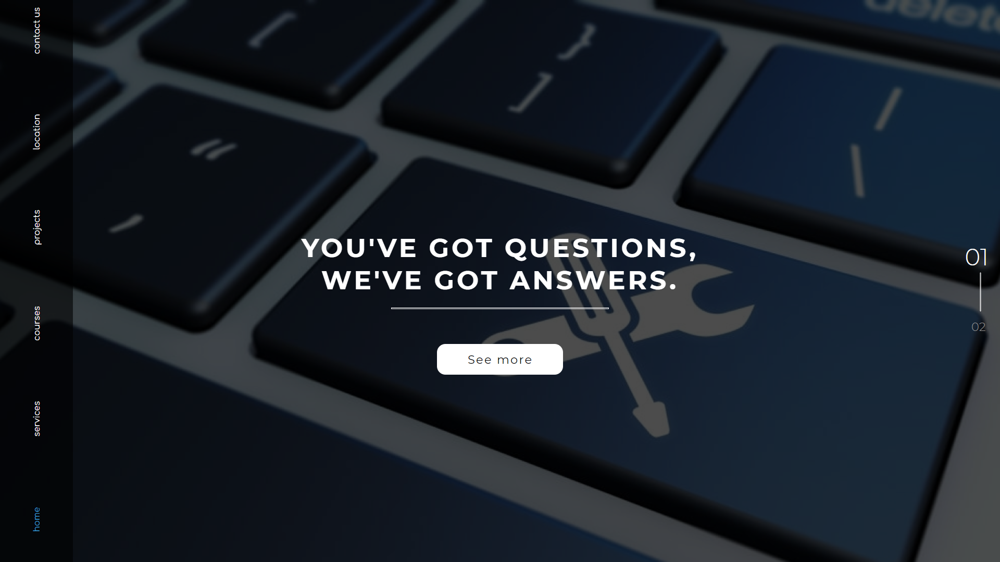
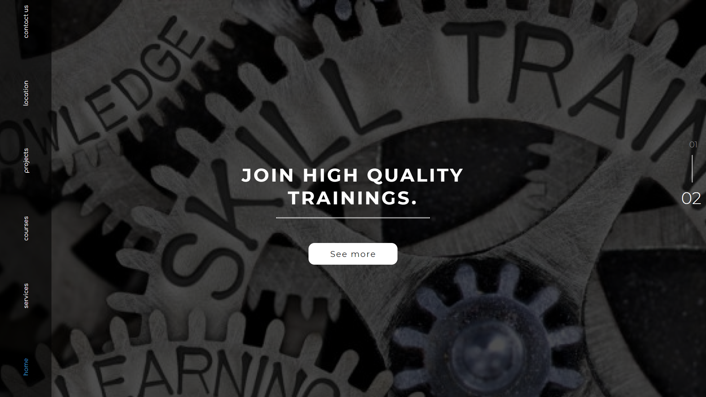
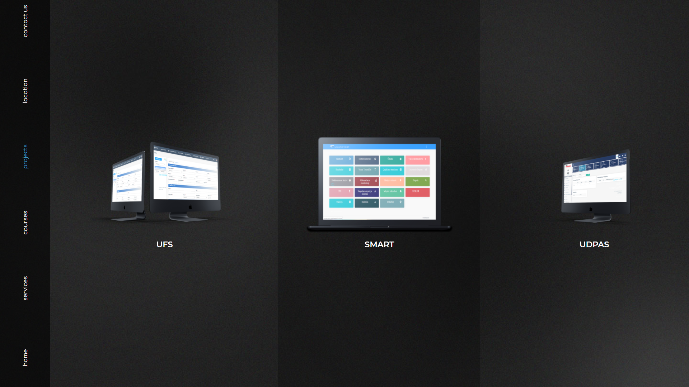
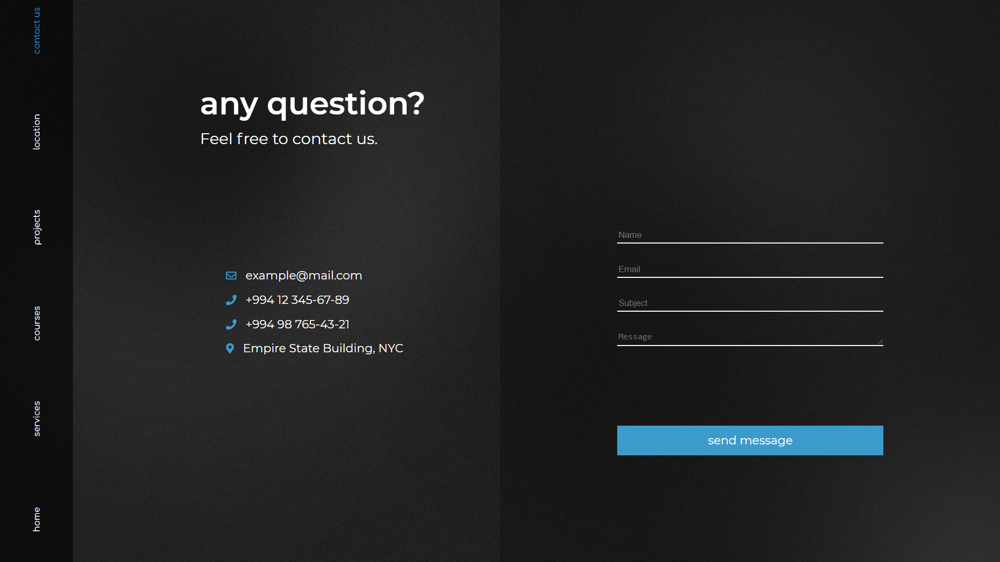

# General info

This is a website of an organization, that provides services in different areas of IT, such as design, coding, consulting, educational courses, etc.

The home page contains 2 parts, between which you can switch using the numbers.

Service and course pages simply contain information about services they provide and lists of courses, respectively.

The project page contains some examples of projects developed by this organization with brief information.

Contact page contains phone numbers, mail, and address of the company. Moreover, it allows you to send a message to the company. While the location page contains only the address of the organization given on the map.

---

# Screenshots

---
### Designed by
[Narmin Mustafaeva (Instagram)](https://www.instagram.com/logowoman_/)

